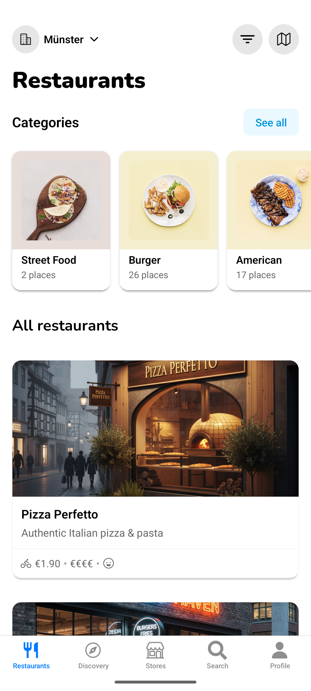

# Wolt Clone



A feature-rich React Native clone of the Wolt food delivery app, showcasing modern mobile development practices with React Native, Expo, and TypeScript.

## Features

- User Authentication: Apple and Google sign-in integration
- Restaurant Discovery: Browse restaurants and stores with beautiful UI
- Search & Filter: Find exactly what you're looking for with advanced filters
- Interactive Map: Explore restaurants and delivery zones on an interactive map
- Menu Navigation: Browse detailed menus with categories and items
- Shopping Cart: Add items, manage quantities, and see real-time totals
- Checkout Flow: Complete order flow with delivery scheduling
- Location Selection: Choose delivery locations with address management
- Smooth Animations: Fluid transitions and gestures powered by Reanimated
- Tab Navigation: Bottom tabs for easy navigation between sections

## Tech Stack

- Expo Router - File-based routing and navigation
- React Native Reanimated - Smooth animations and transitions
- React Native Gesture Handler - Touch interactions
- MapLibre - Interactive maps integration
- Expo Linear Gradient - Beautiful gradient effects
- Zustand - State management for cart and user data
- MMKV - The fastest key/value storage for React Native
- Sentry - Error tracking and performance monitoring

## Installation

1. Clone the repository

   ```bash
   git clone https://github.com/AdhurimBerisha/Wolt-Clone.git
   ```

2. Install dependencies

   ```bash
     npm install
   ```

3. Prebuild the native code

   ```bash
   npx expo prebuild
   ```

4. Run the app
   ```bash
   npx expo run:android/ios
   ```
